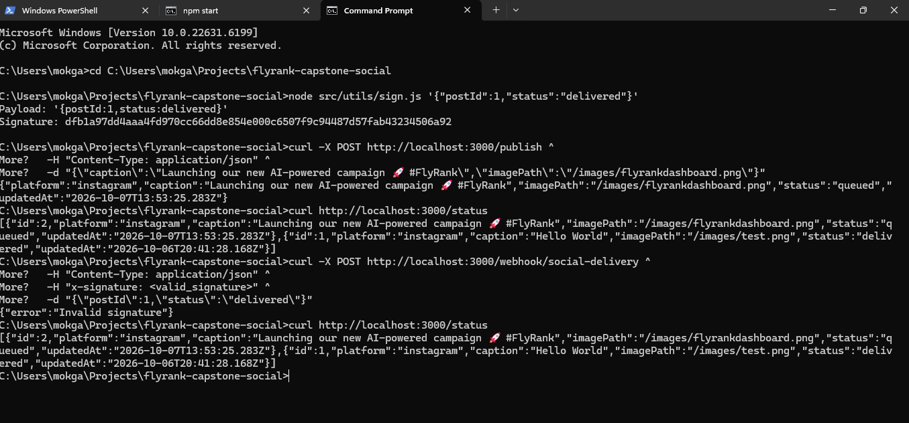
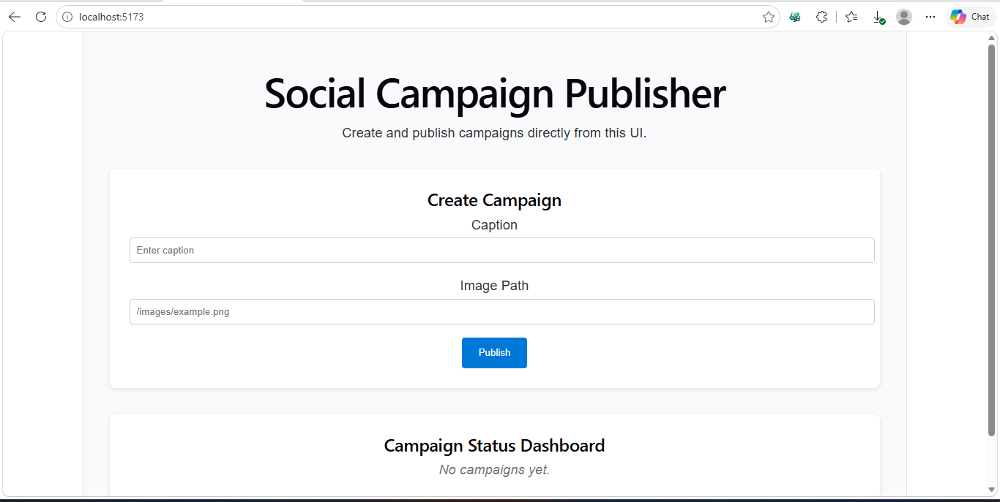

## 📛 Project Badges


# FlyRank Capstone — Multi‑Platform Social Campaign Publisher + LLM API Integration

## Overview
This project demonstrates backend reliability engineering by combining:
- A social campaign publisher (image pipeline, caption composer, durable scheduling).
- An LLM‑backed API endpoint (`/triage`) that classifies support messages into trusted JSON output.

The goal is to simulate a realistic production system without touching real social accounts, while showing how to integrate an LLM safely (timeouts, retries, schema validation, kill switch).

---

## 🚀 Flow
- Frontend CampaignForm → POST /publish with caption + imagePath

- Backend /publish → inserts campaign into SQLite

- Frontend StatusDashboard → polls /status every 5s

- Backend /status → returns persisted campaigns

- Webhook /webhook/social-delivery → updates campaign status with signature validation


---

## 📦 Prerequisites
- Node.js (>=18)

- Docker + Docker Compose

- Redis (via Docker)

- SQLite or PostgreSQL (via Docker)

- Git

- OpenRouter account (for free LLM API key)

---

### Installation
```bash
git clone https://github.com/<your-username>/flyrank-capstone-social.git
cd flyrank-capstone-social
npm install
```
---

### Environment Variables
Create a .env file based on .env.example:

```bash
cp .env.example .env
```
---

Fill in values:
```bash
DB_URL=sqlite://./db.sqlite
REDIS_URL=redis://localhost:6379
SECRET_KEY=my_secret_key_here
PORT=3000

# --- LLM Integration ---
OPENROUTER_API_KEY=sk-your-real-key-here
LLM_DISABLED=false

```
### ▶️ Run
```bash
docker compose up
npm run migrate   # sets up SQLite schema
npm run seed      # seed demo data
npm start         # start backend
```
Backend runs at:
http://localhost:3000


## 🧪 Example Commands (Backend Testing)
### 1. Publish a campaign
```bash
curl -X POST http://localhost:3000/publish ^
  -H "Content-Type: application/json" ^
  -d "{\"caption\":\"Launching our new AI-powered campaign 🚀 #FlyRank\",\"imagePath\":\"/images/flyrankdashboard.png\"}"
```

**Expected response**:
```bash
{
  "platform": "instagram",
  "caption": "Launching our new AI-powered campaign 🚀 #FlyRank",
  "imagePath": "/images/flyrankdashboard.png",
  "status": "queued",
  "updatedAt": "2026-10-07T14:12:00.000Z"
}
```
### 2. Check campaign status
```bash
curl http://localhost:3000/status
```
**Expected response**:

```bash
[
  {
    "id": 1,
    "platform": "instagram",
    "caption": "Launching our new AI-powered campaign 🚀 #FlyRank",
    "imagePath": "/images/flyrankdashboard.png",
    "status": "queued",
    "updatedAt": "2026-10-07T14:12:00.000Z"
  }
]
```
### 3. Webhook delivery simulation

```bash
curl -X POST http://localhost:3000/webhook/social-delivery ^
  -H "Content-Type: application/json" ^
  -H "x-signature: <valid_signature>" ^
  -d "{\"postId\":1,\"status\":\"delivered\"}"

```
**Expected response**:
```bash
{ "success": true }
```

---

### 4. Verify status update
```bash
curl http://localhost:3000/status
```

**Expected response**:

```bash
json
[
  {
    "id": 1,
    "platform": "instagram",
    "caption": "Launching our new AI-powered campaign 🚀 #FlyRank",
    "imagePath": "/images/flyrankdashboard.png",
    "status": "delivered",
    "updatedAt": "2026-10-07T14:15:00.000Z"
  }
]
```
---

### 📜 Automated Backend Test Script
Save as test-backend.ps1:

```bash
Write-Host "🚀 Starting Backend Automated Tests..."

# Publish

curl -X POST http://localhost:3000/publish `
  -H "Content-Type: application/json" `
  -d '{"caption":"Launching our new AI-powered campaign 🚀 #FlyRank","imagePath":"/images/flyrankdashboard.png"}'

# Status

curl http://localhost:3000/status

# Webhook (replace <valid_signature>)

curl -X POST http://localhost:3000/webhook/social-delivery `
  -H "Content-Type: application/json" `
  -H "x-signature: <valid_signature>" `
  -d '{"postId":1,"status":"delivered"}'

# Final Status
curl http://localhost:3000/status

Write-Host "🎯 Backend test flow complete!"
```

---


## 📂 Project Structure

flyrank-capstone-social/
│   .env
│   .env.example
│   .gitignore
│   docker-compose.yml
│   Dockerfile
│   init.sql
│   package.json
│   README.md
│
├── client/                # React frontend
│   ├── public/images/     # static assets
│   │   └── flyrankdashboard.png
│   ├── src/
│   │   ├── components/
│   │   │   └── CampaignForm.jsx
│   │   ├── App.jsx
│   │   └── main.jsx
│   └── package.json
│
├── src/                   # Node.js backend
│   ├── db.js
│   ├── server.js
│   ├── repository/
│   │   ├── memoryRepo.js
│   │   ├── postgresRepo.js
│   │   └── sqliteRepo.js
│   └── routes/
│       ├── tasks.js
│       └── status.js
│
├── ai-version/            # optional LLM integration
└── screenshots/           # demo screenshots
    ├── automated-backend-test-run.png
    └── CampaignForm.png

---

## 📸 Demo Screenshots

### Backend Automated Test Run


This screenshot shows the PowerShell automated test script publishing a campaign, checking status, simulating webhook delivery, and verifying the updated status in SQLite.

---

### Frontend CampaignForm


This screenshot shows the React UI with caption + image path input fields and the **Publish** button, alongside the Campaign Status Dashboard displaying campaign statuses.


---

## 📑 Required Files
- `README.md` — this file

- `capstone.yaml` — manifest for evaluator

- `EVIDENCE.md` — proofs for definition‑of‑done

- `BUILDLOG.md` — AI usage log

- `.env.example` — safe placeholder values

- `.env` — runtime secrets (ignored by Git)

---

### ⚠️ Limitations
Fake platform adapters simulate publishing; real platform publishing is optional stretch goal.

Focus is backend reliability, not artistic image quality.

---

## 📜 License
MIT License — free to use and learn from.

---
## Portfolio Highlight

*Showcasing backend reliability engineering and LLM integration in a production‑style project.*

---


© Leonard Phokane 2026. All rights reserved.


